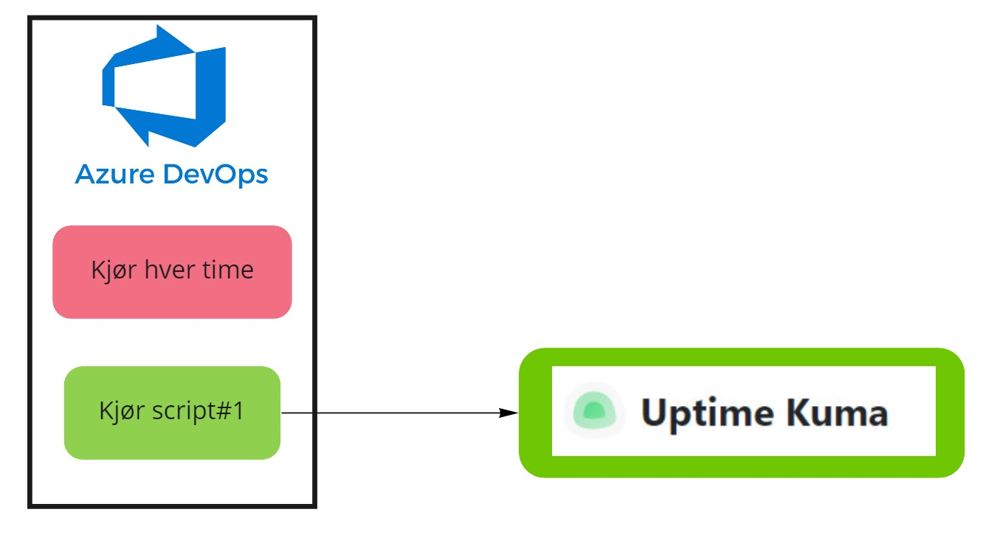
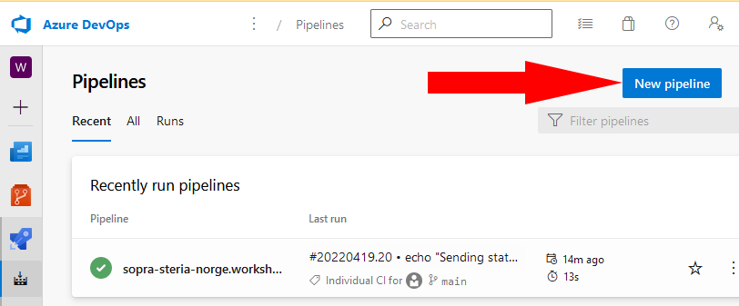
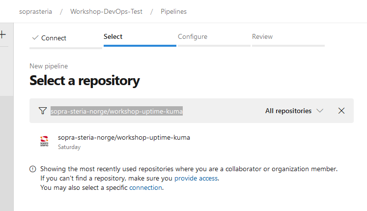
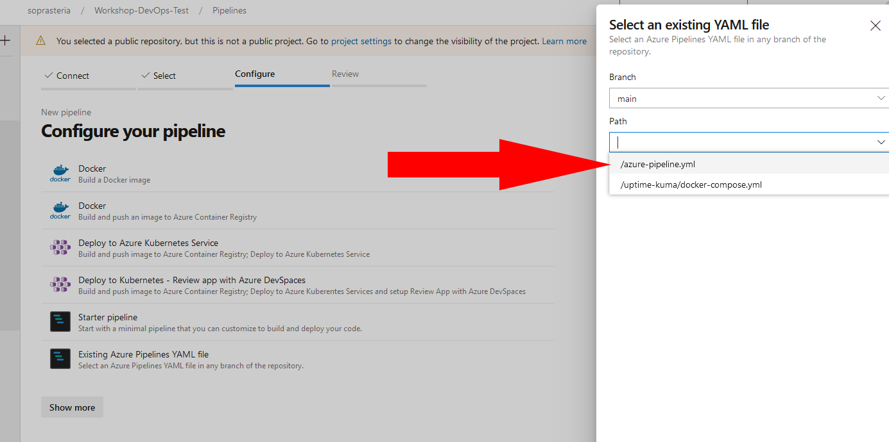
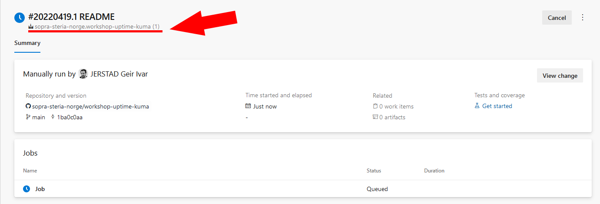
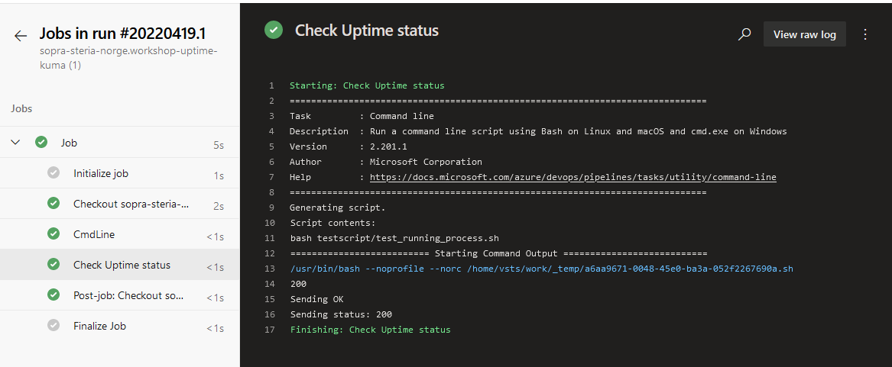
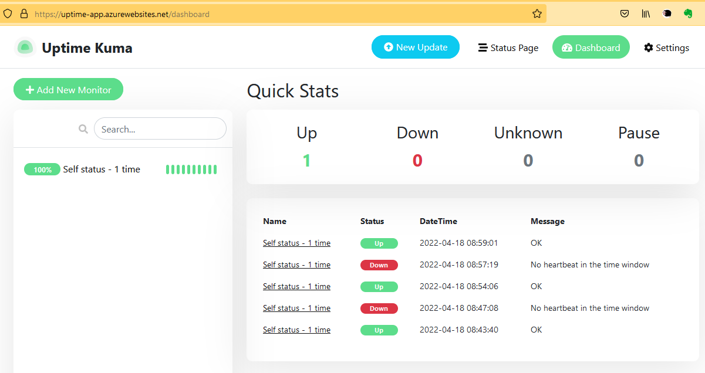

# Workshop med Azure DevOps Pipeline og Uptime Kuma #

Workshop som bruker Azure DevOps Pipeline og Uptime Kuma til å lage automatisk monitorering

## Legg til en pipeline i Azure DevOps

### Mål

I denne workshoppen skal vi legge til en pipeline som kjører noen tester automatisk og rapporterer til et monitor dashboard.

### Hvorfor

Dette viser hvordan du kan enkelt komme i gang med å bruke en CI/CD pipeline til å sette i gang testscript som tester en tjeneste. Denne pipelinen vil kjøre jevnlig, men også ved hver endring i testen som blir lagret.




Vi skal bruker Azure DevOps til å kjøre et script som oppdaterer  [Uptime]( https://github.com/louislam/uptime-kuma) som er en monitortjeneste.

**Steg 1 - Logg inn i Azure DevOps**

- Gå til https://dev.azure.com/soprasteria/Workshop-DevOps-Test/_build
- Logg inn med Sopra Steria brukeren

**Steg 2 - Lag ny pipeline**

- Trykk på "**New pipeline**"



- Velg "**GitHub**"
- Skriv inn: **sopra-steria-norge/workshop-uptime-kuma** i søkeboksen og velg det som dukker opp



- Velg "**Exisiting Azure Pipelines YAML file**" og velg "**/azure-pipeline.yml**"



- Trykk på "**Continue**"
- Trykk på "**Run**"

Da skal du få noe som ser omtrent slik ut:



Pilen viser navnet på pipelinen.


**Steg 3 - Se på kjøringen**

- Trykk på "**Job**"



- Trykk på "**Check Uptime status**"

Denne tekskten viser at Uptime er responsiv og sender melding til Uptime at den er OK :)


**Steg 4 - Se på monitor dashboard**

- Gå til https://uptime-app.azurewebsites.net/dashboard



Denne monitoren viser at status er OK.


```
name: $(Date:yyyyMMdd)$(Rev:.r)

trigger:
  branches:
    include:
    - main

    # https://crontab.guru/#*/30_*_*_*_*
schedules:
  - cron: "*/30 * * * *"
    displayName: At every 30th minute
    branches:
      include:
        - main
    always: true

    
steps:
- script: ls '$(System.DefaultWorkingDirectory)'

- script: |
    bash testscript/test_running_process.sh
  displayName: Check Uptime status

```


